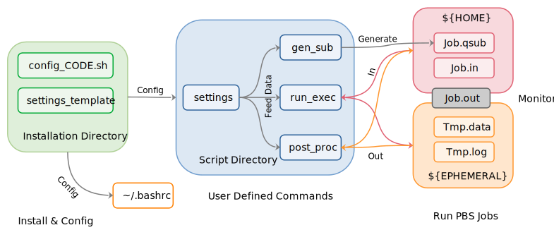

# General job submitter for ARCHER2

A general job submission script for parallel programs for the SLURM batch system on [ARCHER2](https://www.archer2.ac.uk/) UK national supercomputing service. Based on Linux Bash Shell.

## Quick reference

### Commands and corresponding in-line flags

**Nomenclature**  

Upper case letter(s) for job definition + lower case letters for executable + version number

Here the configuration of 'CRYSTAL17' is used as the example. 

| COMMAND    | FLAGS                                             | DEFINITION                                               |
|:-----------|:-------------------------------------------------:| :--------------------------------------------------------|
| Pcrys17    | -in -nd -wt -ref(Optional) -nc                    | Run parallel CRYSTAL17 crystal executable                |
| Pprop17    | -in -nd -wt -ref(Optional) -nc                    | Run parallel CRYSTAL17 properties executable             |
| MPPcrys17  | -in -nd -wt -ref(Optional) -nc                    | Run massive parallel CRYSTAL17 crystal executable        |
| Scrys17    | -in -nd -wt -ref(Optional) -nc                    | Run sequential CRYSTAL17 executable (for illustration, not implemented) |
| Xcrys17    | -x -in -nd -wt -ref(Optional) -name(Optional) -nc | Run user-defined multiple jobs (see advanced section)    |
| SETcrys17  | No flag                                           | Print the local (user-defined) 'settings' file on screen |
| HELPcrys17 | No flag                                           | Print instructions on screen                             |

### Command-line flags

In the table below are listed command line flags for script `gen_sub`. The sequence of flags is arbitrary.

| FLAG  | FORMAT | DEFINITION                                                               |
|:------|:------:| :------------------------------------------------------------------------|
| -x    | string | Executable label, see the 'EXE\_TABLE' of settings file                  |
| -in   | string | The main input file                                                      |
| -nd   | int    | Number of nodes requested for the job                                    |
| -nc   | int    | Total number of cores requested for the job                              |
| -nt   | int    | Number of threads per process. Mulit/Sub-CPU threading is prohibited     |
| -wt   | hh:mm  | Walltime requested for the job                                           |
| -ref  | string | The common basename (without extensions) of reference files              |
| -name | string | The name of slurm file                                                   |
| -set  | string | The path of settings file, developer only                                |
| -help | string | Print instructions. Already integrated in command `HELPcrys17`           |

### Keywords and default values

Parameters are defined in local 'settings' file. By default it is in `${HOME}/etc/runCRYSTAL17/` directory (CRYSTAL17 as an example).

| KEYWORD                   | DEFAULT VALUE   | DEFINITION                                                            |
|:--------------------------|:---------------:|:----------------------------------------------------------------------|
| SUBMISSION\_EXT           | .slurm          | The extension of job submission script                                |
| NCPU\_PER\_NODE           | 128             | Number of processors per node                                         |
| MEM\_PER\_NODE            | -               | For Imperial CX1. Not used                                            |
| NTHREAD\_PER\_PROC        | 1               | Number of threads. Multi-threading within 1 CPU is prohibited         |
| NGPU\_PER\_NODE           | -               | For Imperial CX1. Not used                                            |
| GPU\_TYPE                 | -               | For Imperial CX1. Not used                                            |
| BUDGET\_CODE              | \[depends\]     | Budget code for ARCHER2 resource allocation                           |
| QOS                       | standard        | Quality of service. See [ARCHER2 Manual](https://docs.archer2.ac.uk/user-guide/scheduler/#quality-of-service-qos)   |
| PARTITION                 | standard        | Job partition. See [ARCHER2 Manual](https://docs.archer2.ac.uk/user-guide/scheduler/#partitions)  |
| TIME\_OUT                 | 3               | Unit: min. Time spared for post processing                            |
| JOB\_TMPDIR               | \[depends\]     | The temporary directory for data files generated during a job         |
| EXEDIR                    | \[depends\]     | Directory of executable / Module load command                         |
| MPIDIR                    | \[depends\]     | Directory of MPI / Module load command                                |
| EXE\_TABLE                | \[Table\]       | Label (for -x flag) + MPI & executable option combinations            |
| PRE\_CALC                 | \[Table\]       | Saved and temporary names of input files (see following sections)     |
| REF\_FILE                 | \[Table\]       | Saved and temporary names of reference files (see following sections) |
| POST\_CALC                | \[Table\]       | Saved and temporary names of output files (see following sections)    |
| JOB\_SUBMISSION\_TEMPLATE | \[script\]      | Template for job submission scripts                                   |

## New user: Basic instructions

### Configure the job submission script

Taking 'CRYSTAL17' as the example. The following steps are necessary to set up a local 'settings' file, where values of keywords are configured according to your local environment:

1. To be safe, visiting other user's directory is not allowed. Clone the repository to a local directory, for example, `/work/e90/user/ARCHER2-Job-Submission`. Change `CRYSTAL17/config_CRYSTAL17.sh` accordingly if another executable is to be used.  

``` console
~$ bash /work/e90/user/ARCHER2-Job-Submission/CRYSTAL17/config_CRYSTAL17.sh
```

2. Specify the directory of 'settings' file. By default, it is `/work/e90/user/etc/runCRYSTAL17/settings`.  
3. Specify the directory / command of executable. Typically default value is sufficient. Press 'Enter' to continue.  
4. Specify the directory / command of MPI executable. Typically default value is sufficient. Press 'Enter' to continue.  
5. After the instruction is printed out, use the following command to enable commands:

```
~$ source ~/.bashrc
```

### Use commands

After configuration, commands to generate the corresponding job submission file (slurm file) are defined in `~/.bashrc`. Detailed definitions of commands can be found in the previous section and by `HELPcrys17` command. For example, the following command generates and submits a slurm file for input file 'mgo.d12'. The job uses 1 node and the number of CPUs per node is read from the `NCPU_PER_NODE` keyword in settings file. The maximum time allowance for this job is 1 hour.

``` console
~$ Pcrys17 -in mgo.d12 -nd 1 -wt 01:00
~$ sbatch mgo.slurm
```

Alternatively, `-nc` flag can be specify the total number of CPUs used. If `-nc` < `NCPU_PER_NODE`, a single node is used; otherwise CPUs are equally partitioned over the minimum nodes needed. When both `-nd` and `-nc` are specified, `-nc/-nd` is compared with `NCPU_PER_NODE` and the former one must be smaller. `-nc` CPUs are equally partitioned over `-nd` nodes. If neither of them is specified, `NCPU_PER_NODE` is read from settings file and `-nd` = 1. Warning message will be given. The following job requests 2 nodes of 12 CPUs.

``` console
~$ Pcrys17 -in mgo.d12 -nc 24 -nd 2 -wt 01:00
```

It is highly recommended to generate slurm files in the same directory as input files, though in principle, the user can generate slurm files and get the 'slurm-`${SLURM_JOB_ID}`.out' file in a separate directory. This feature is rarely tested and might lead to unexpected results - and somewhat meaningless because all the job-related files, including .out file, are stored in the input directory.  

`-nt` flag specifies number of threads per process. If not specified, `NTHREAD_PER_PROC` are read from settings file. Number of processes = Total number of CPUs / `-nt`. Multi/Sub-CPU threading is forbidden. The following example requests 2 CPUs but 4 threads per process, which leads to error:

``` console
~$ Pcrys17 -in mgo.d12 -nc 2 -nt 4 -wt 01:00
```

The following example requests 8 CPUs, 2 nodes. On each node, there are: 4 CPUs, 2 processes. Each process containes 2 threads and each thread is run on 1 CPU.

``` console
~$ Pcrys17 -in mgo.d12 -nc 8 -nt 4 -nd 2 -wt 01:00
```

If `-nc` is not an integer multiply of `-nd` or `-nt`, the number of CPUs requested might change accordingly by rounding it to the nearest integer that is smaller than the specified one. For example, 4 CPUs instead of 5 are used:

``` console
~$ Pcrys17 -in mgo.d12 -nc 5 -nd 2 -wt 01:00
```

### Common Outputs

Although parallel codes differ from each other, 2 common outputs are generated. 

**.out file**  
Output information of the code, CRYSTAL17, for example. Also includes the input file and basic information from the job submission script, such as the path to the ephemeral directory and files copied.

**slurm-`${SLURM_JOB_ID}`.out file / .log file**  
A verbose version output, error and warning messages (that should be printed on screen) of job submission script & MPI, for debugging. Besides the basic information included in .out file, it includes the list of scripts and commands used, synchronization of files and the list of files in the ephemeral directory. When job is running or killed by the user, it is 'slurm-`${SLURM_JOB_ID}`.out' and when job terminates normally or run out of time, it is '.log' file.

### When a job terminates

There are 4 probable occasions of job termination. If an ephemeral directory is defined, i.e., 'JOB\_TMPDIR' in 'settings' is not 'nodir', temporary files generated during calculation might be either in the output directory or in the ephemeral directory.

1. For normal termination, all the non-empty files are kept in the output directory, with 'SAVED' names. The ephemeral directory will be removed.  
2. If the job is terminated due to exceeding walltime, same as normal termination.  
3. If the job is terminated due to error, same as normal termination.  
4. If the job is killed by user, the ephemeral directory remains intact when `JOB_TMPDIR` is not 'node' (see sections below). The user can refer to '.out' file or 'slurm-`${SLURM_JOB_ID}`.out' file for the path to ephemeral directory and manually move them to output directory. Note that all the inputs are copied from local so there is not need to copy inputs back.  

### How to use settings file

The 'settings' file is a dictionary for reference. Although all the necessary keywords are configured automatically, the user can always change the value of keywords according to their needs. Refer to advanced section for more information.


## Experienced user & Developer: Advanced instructions

### Multiple jobs and 'X' command

The 'X' command allows the maximum flexibility for users to define a PBS job. Taking CRYSTAL17 as the example, using `Xcrys17` can sequentially run multiple jobs. The following code illustrates how to integrate SCF and band calculations of mgo into a single slurm file:

``` console
~$ Xcrys17 -name mgo-band -nd 1 -x pcrys -in mgo.d12 -wt 01:00 -ref no -x pprop -in band.d3 -wt 00:30 -ref mgo
```

To run `Xcrys17` command, the number of in-line flags should follow certain rules:

1. `-name` flag should appear at most only once, otherwise the last one will cover the previous entries. If left blank, the slurm file will be named as `mgo_et_al.slurm` (taking the previous line as an example).  
2. `-nd` `-nc` `-nt` flags should appear at most once. If not specified, `NCPU_PER_NODE` and `NTHREAD_PER_PROC` are read from settings file and `-nd` is set to 1.  
3. `-x` `-in` `-wt` flags should be always in the same length, otherwise error is reported. 
4. `-wt` flag defines the walltime for individual jobs. For each job, by default 3 minutes are spared for post-processing. Check the 'TIME\_OUT' keyword in settings file.   
5. `-ref` flags should have either 0 length or the same length as `-x`. If no reference is needed, that flag should be matched with value 'no'. See the line above.  

When job terminates, the output of each calculation is available in corresponding .out files. If input files have the same name, for example, mgo.d12 and mgo.d3, the output will be attached in the same .out file, i.e., mgo.out, with a warning message dividing the files. Check [testcase of CRYSTAL17 Imperial HPC version](https://github.com/cmsg-icl/HPC-job-submission/tree/main/Imperial-HPC-Job-Submission/CRYSTAL17/testcase)(they are quite similar). On the other hand, SLURM-related outputs, slurm and 'slurm-`${SLURM_JOB_ID}`.out' files, are defined by the `-name` flag.

### Edit the local 'settings' file

In the current implementation, 'settings' is the only file in local environment, which can be edited by the user according to needs. When formatting the 'settings' file, please be noted:

1. Empty lines between keywords and their values are forbidden.  
2. No GPU jobs are supported.  
3. Multiple-line values for keywords other than 'EXE\_TABLE', 'PRE\_CALC', 'FILE\_EXT', 'POST\_CALC' and 'JOB\_SUBMISSION\_TEMPLATE' are forbidden.  
4. Dashed lines and titles for 'table' keywords are used as separators and are not allowed to be removed.  
5. The slurm template attached during initialization is only compatible with the default settings. For user-defined executables, changes might be made accordingly in 'JOB\_SUBMISSION\_TEMPLATE'.

**JOB\_TMPDIR**

4 options are available for this keywords:

1. Left blank for 'default' : The temporary directory will be created as a sub-directory in the input directory, with name 'jobname\_`${SLURM_JOB_ID}`/'  
2. 'nodir' : The job will be run in the current directory and no copy/delete happens. Applicable if the code has bulit-in temporary file management system or requires minimum I/O (usually the case for serial jobs).
3. 'node' : Node-specific temporary files are distributed to the node memory '/tmp/jobname\_`${SLURM_JOB_ID}`/'. Recommanded for large jobs. If the job is killed by the user, temporary files cannot be saved.
5. A given directory, such as `${EPHEMERAL}` : The temporary directory will be created as a sub-directory under the given one, with the name 'jobname\_`${SLURM_JOB_ID}`/'.


*Comments on the 'node' option*

It is suggested to slightly increase 'TIME\_OUT' when using large number of nodes, because directories on every node are scanned in serial to find the latest modificaions of the file when job terminates. Here is an example output run on two nodes:

```
 ============================================
 Post Processing Report
 --------------------------------------------
 Begining of post processing : Tue 18 Feb 2025 06:58:35 PM GMT
 --------------------------------------------
 List of saved files from NODE nid002448
   TEMPORARY            SAVED
 WARNING! Duplicated file: rerestart.gui is covered by fort.34.
   fort.34              rerestart.gui                                         6514     Feb 18 18:50
   FREQINFO.DAT.tsk0    rerestart.freqtsk/FREQINFO.DAT.tsk0                   18235986 Feb 18 18:50
   FREQINFO.DAT.tsk1    rerestart.freqtsk/FREQINFO.DAT.tsk1                   18235986 Feb 18 18:50
   FREQINFO.DAT.tsk2    rerestart.freqtsk/FREQINFO.DAT.tsk2                   18235986 Feb 18 18:55
   FREQINFO.DAT.tsk3    rerestart.freqtsk/FREQINFO.DAT.tsk3                   18235986 Feb 18 18:55
   fort.13              rerestart.f13                                         3569544  Feb 18 18:50
 --------------------------------------------
 List of saved files from NODE nid002413
   TEMPORARY            SAVED
 WARNING! Duplicated file: rerestart.gui is covered by fort.34.
   fort.34              rerestart.gui                                         6514     Feb 18 18:50
   SCFOUT.LOG           rerestart.SCFLOG                                      35040    Feb 18 18:50
 WARNING! Duplicated file: rerestart.freqtsk/FREQINFO.DAT.tsk0 is covered by FREQINFO.DAT.tsk0.
   FREQINFO.DAT.tsk0    rerestart.freqtsk/FREQINFO.DAT.tsk0                   18235986 Feb 18 18:55
 WARNING! Duplicated file: rerestart.freqtsk/FREQINFO.DAT.tsk1 is covered by FREQINFO.DAT.tsk1.
   FREQINFO.DAT.tsk1    rerestart.freqtsk/FREQINFO.DAT.tsk1                   18235986 Feb 18 18:55
 WARNING! Duplicated file: rerestart.freqtsk/FREQINFO.DAT.tsk2 is the latest and kept.
 WARNING! Duplicated file: rerestart.freqtsk/FREQINFO.DAT.tsk3 is the latest and kept.
 WARNING! Duplicated file: rerestart.f13 is covered by fort.13.                                                                                            
   fort.13              rerestart.f13                                         3569544  Feb 18 18:50
 --------------------------------------------
```

**EXE\_TABLE** 
For each job submission script, multiple executables can be placed in the same directory, 'EXEDIR'. The corresponding commands to launch the executables are listed in 'EXE\_TABLE'. The following table gives information of each column. 

| NAME                | RECOGNIZABLE LENGTH | EXPLANATION                                                               |
|:--------------------|:-------------------:| :-------------------------------------------------------------------------|
| LABEL               | 11                  | Alias of MPI+executable combination. Input of `-x` flag. No space allowed |
| MPI & OPTION        | 61                  | In-line commands of MPI, such as 'mpiexec'                                |
| EXECUTABLE & OPTION | 61                  | In-line commands of executable, such as 'gulp-mpi < \[jobname\].gin'      |
| DEFINITION          | Not read            | Definitions for reference                                                 |

Variable symbols `${V_VARIABLE}` defined under keyword 'JOB\_SUBMISSION\_TEMPLATE' are, in principle, compatible in 'MPI & OPTION' and 'EXECUTABLE & OPTION' columns. But such practice is not recommended to keep the structure clear and consistent. Using the 'pseudo' regular expression scheme (see below) and exporting environment variables in qsub file is preferred unless in line commands + variables are inevitable. For the definitions of `${V_VARIABLE}`, see below.

**PRE\_CALC, REF\_FILE and POST\_CALC**

Both tables function as file references before computation. Although 'PRE\_CALC' and 'REF\_FILE' share almost the same rules (see below), it is recommended that files with the same name as input file (the value of `-in` flag) should be listed in the former and the input reference (`-ref` flag) listed in the latter. The 'SAVED' column specifies the file names in input directory, while 'TEMPORARY' specifies the file names in ephemeral directory. Lengths of both 'SAVED' and 'TEMPORARY' columes should be 21 characters to ensure the values can be read. The 'DEFINITION' column will not be scanned. This part is skipped if 'JOB\_TMPDIR' is 'nodir'.

In practice, `run_exec` and `post_proc` scan all the formats listed and moves all the matching files forward and backward. Missing files will in any case not lead to abruption of jobs since file existence has been checked when generating slurm files. However, the priority changes when duplicate files are found in distination directory (ephemeral for 'PRE\_CALC' and 'REF\_FILE', input for 'POST\_CALC'). In all cases, that would lead to a warning message in both .out and 'slurm-`${SLURM_JOB_ID}`.out' files.

1. When duplicate file is defined in 'PRE\_CALC', `run_exec` will cover the old one with the new entry, unless the old one is the file specified by `-in` flag.  
2. When duplicate file is defined in 'REF\_FILE', `run_exec` will ignore the new entry and keep the old one.  
3. When duplicate file is defined in 'POST\_CALC', `post_proc` will cover the old one with the new entry  

**A 'pesudo' regular expression scheme**

To ensure the generality, a 'pseudo' regular expression is used. Note that not all the sym

| SYMBOL  | Definition                                                                                   |
|:--------|:---------------------------------------------------------------------------------------------|
| \[job\] | Value of `-in` flag without extension and upper-level folder                                 | 
| \[ref\] | Value of `-ref` flag without extension and upper-level folder                                |
| \*      | Match any character for any times. A single '\*' in destination means keep the original name |
| /       | Creat a folder rather than copy as files                                                     |

Note:

1. Typically the 'text\*' expression is used in 'SAVED' column and '\*' is used in 'TEMPORARY' column. '/' can be used in both.  
2. In 'SAVED' colume, both 'PRE\_CALC' and 'POST\_CALC' allow \[job\] only, while 'REF\_FILE' allows \[ref\] only.  
3. In practice, any text begins with \[job or \[ref and ends with \] are recognized and substituted. In fact, in files configured eariler, keywords \[jobname\] and \[refname\] were used. New keywords are adopted to spare space for command options.  
4. In principle, \[job\] and \[ref\] can be placed at any part of the file name, but it is strongly recommended to keep them as the beginning of file name to keep the consistency.

**JOB\_SUBMISSION\_TEMPLATE and `${V_VARIABLE}`**

Job submission template offers a template for qsub files, which contains essential set-ups perior to the parallel jobs and post-processing commands after the parallel job is finished. Variable symbols `${V_VARIABLE}` are defined in this block for substitution by the 'gen\_sub' script. Their values and difinitions are listed in the table below.

| SYMBOL         | Definition                                                         |
|:---------------|:-------------------------------------------------------------------|
| `${V_JOBNAME}` | PBS job name                                                       |
| `${V_ND}`      | Number of nodes                                                    |
| `${V_NCPU}`    | Number of CPUs per node                                            |
| `${V_MEM}`     | Memory allocation per node, in GB                                  |
| `${V_PROC}`    | Number of processes per node                                       |
| `${V_TRED}`    | Number of threads per process                                      |
| `${V_NGPU}`    | ':ngpus=' + Number of GPUs per node                                |
| `${V_TGPU}`    | ':gpu\_type=' + Type of GPU node                                   |
| `${V_TWT}`     | Total wall time (timeout + post processing) requested by qsub file |
| `${V_TPROC}`   | Total number of processes (`${V_PROC}` \* `${V_ND}`)               |

### Structure of the repository

Scripts in the main folder, i.e., `gen_sub`, `run_exec`, `post_proc` and `settings_template` are common scripts for job submission and post processing, of which the first 3 are executable. `settings_template` will be named as `settings` after being configured.

`gen_sub` - Process the options in command line, execute necessary checks (file existence, walltime and node format) and generate the slurm file.  
`run_exec` - Move and rename input files from the home directory to the ephemeral directory, sync nodes and launch (usually) parallel jobs.  
`post_proc` - Save output files to the home directory and remove the ephemeral directory.  
`settings_template` - A formatted empty list of keywords. It will be configured when running configure scripts such as `config_CRYSTAL17.sh`.
`version_control.txt` - Information of version numbers and authorship.

In the sub-folders with specific names of simulation codes. Taking CRYSTAL17 as the example, the configuration file is `config_CRYSTAL17.sh`, which is called during installation. The `run_help` script (a rather easy one) is launched by `HELPcrys17` command. The `settings_example_CRYSTAL17` gives an example of configured settings file and the `testcase` directory contains an example run on IC-CX1.

The basic principle of this job submission script is illustrated in the figure below (though it is used for PBS batch systems, which is quite similar in principle):



### How to generate a configuration file

Configurations scripts `config_CODE.sh` and help information `run_help` (a rather simple one) are code-specific so are stored separately in sub-folders with code names. Typically the core sriptes `gen_sub` `run_exec` and `post_proc` do not need revision unless bug is identified. Examples (`config_example_CRYSTAL17.sh` and `run_help_example_CRYSTAL17`) are placed in the main directory for illustrating proposes. Lines need modification are marked with comment lines `#---- BEGIN_USER ----#`, `#---- END_USER ----#`. Several considerations suggested:

1. Title line and version number, which should be provided in a separate file [version\_control.txt](https://github.com/cmsg-icl/crystal_shape_control/tree/main/ARCHER2-Job-Submission/version_control.txt), which has clear instructions for reference.  
3. Script directory: The default directory  
4. Executable directory: The default executable directory or `module load` command  
5. MPI directory: The default executable directory or `module load` command   
6. Default parameters for parallel jobs: Cores per node and GPUs (if necessary)  
7. EXE\_TABLE: The correct in-line commands to launch the job and a simple alias for it  
8. PRE\_CALC: General format of inputs  
9. FILE\_EXT: General format of references  
10. POST\_CALC: General format of outputs  
11. JOB\_SUBMISSION\_TEMPLATE: Specific environmental setups for the code, such as other modules needed (especially when the code is dynamically linked), or important environmental variables if the executable is directly called  
12. Alias: Check the nomenclature of commands in quick reference

## Program specific instructions

### CRYSTAL17

*Configure file not maintained anymore. Please refer to the latest version of CRYSTAL.*

*Author: Spica. Vir.*

**Default settings file**

${WORK}/etc/runCRYSTAL17/settings

Note: `${WORK}` is not a default environmental variable. It is used here for convenience, referring to the user's topmost working directory.

**Default executable**

crystal/17-1.0.2 (shared module)

| LABEL   | ACTUAL IN-LINE COMMAND |
|:-------:|:-----------------------|
| pcrys   | mpiexec Pcrystal       | 
| mppcrys | mpiexec MPPcrystal     |
| pporp   | mpiexec Pproperties    |

**Default ephemeral directory**

'default'

**Commands**  
`Pcrys17` `MPPcrys17` `Pprop17` `Xcrys17` `SETcrys17` `HELPcrys17`

**Command used for testcase**

No test

### CRYSTAL23

*Author: Spica. Vir.*

**Default settings file**

${WORK}/etc/runCRYSTAL23/settings

**Default executable**

crystal/23-1.0.1-3 (shared module)

| LABEL      | ACTUAL IN-LINE COMMAND                                             |
|:----------:|:-------------------------------------------------------------------|
| pcrys      | srun --hint=nomultithread --distribution=block:block Pcrystal      |
| pcrysomp   | srun --distribution=block:block PcrystalOMP                        |
| mppcrys    | srun --hint=nomultithread --distribution=block:block MPPcrystal    |
| mppcrysomp | srun --distribution=block:block MPPcrystalOMP                      |
| pporp      | srun --hint=nomultithread --distribution=block:block Pproperties   |
| pporp      | srun --hint=nomultithread --distribution=block:block MPPproperties |

**Default ephemeral directory**

'default'

**Commands**  
`Pcrys23` `OPcrys23` `MPPcrys23` `OMPPcrys23` `Pprop23` `MPPprop23` `Xcrys23` `SETcrys23` `HELPcrys23`

**Command used for testcase**

``` console
~$ Pcrys23 -in 6x6-mv.d12 -nd 1 -wt 00:10
```

### Quantum Espresso 7

*Author: Spica. Vir.*

**Default settings file**

${HOME}/etc/runQE7/settings

**Default executable**

quantum\_espresso/7.1 (shared module)

| LABEL | ACTUAL IN-LINE COMMAND                                               |
|:-----:|:---------------------------------------------------------------------|
| pw    | srun --hint=nomultithread --distribution=block:block pw.x < [job].in |
| ph    | srun --hint=nomultithread --distribution=block:block ph.x < [job].in |
| cp    | srun --hint=nomultithread --distribution=block:block cp.x < [job].in |
| pp    | srun --hint=nomultithread --distribution=block:block pp.x < [job].in |

**Default ephemeral directory**

'nodir'

Note: In practice, the environment vairable `${ESPRESSO_TMPDIR}=${JOBNAME}_${SLURM_JOB_ID}` is exported, which utilises the built-in temporary file management feature of Quantum Espresso.

**Commands**  
`PWqe7` `PHqe7` `CPqe7` `PPqe7` `Xqe7` `SETqe7` `HELPqe7`

**Command used for testcase**

``` console
~$ PWqe7 -in f1-scf.in -nd 1 -wt 00:30
```

